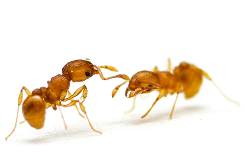

## Introduction

Little Fire Ants (Wasmannia auropunctata), originally from Central and South America, have become a significant invasive species in Maui, posing threats to local wildlife, agriculture, and even human health due to their painful stings.

## Impact of Little Fire Ants

- **Biodiversity**: Little Fire Ants can outcompete native ant species, disrupting local ecosystems.
- **Agriculture**: These ants farm aphids that damage crops and can lead to agricultural losses.
- **Public Health**: Their stings can cause severe allergic reactions and discomfort to humans and animals.

## Identifying Little Fire Ants

- **Size**: Very small, about 1/16 inch long.
- **Color**: Light orange to red.
- **Behavior**: Tend to move slowly and can be found in large numbers.

## Management Strategies

### Monitoring and Detection

- Regularly inspect your property for LFA using bait traps.
- Participate in community surveys to help track the spread.

### Control Methods

- Use approved ant baits that are specifically designed to target Little Fire Ants.
- Maintain regular treatment schedules to effectively reduce their numbers.

### Prevention

- Ensure plants and materials brought onto your property are ant-free.
- Educate the community about the importance of preventing the spread of LFAs.

## Reporting Sightings

If you suspect the presence of Little Fire Ants on your property or locality, report it to the local invasive species committee immediately:

- **Phone**: [Local Invasive Species Committee Contact Number]
- **Online Reporting**: [Link to Local Invasive Species Committee Reporting Page]

By understanding and combating the spread of Little Fire Ants, we can protect Maui's unique environment and ensure the safety of its inhabitants.

For more detailed information and resources, please visit [Hawaii Invasive Species Council](https://dlnr.hawaii.gov/hisc/info/invasive-species-profiles/little-fire-ant/).
