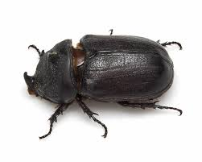

## Introduction

The Coconut Rhinoceros Beetle (_Oryctes rhinoceros_), an invasive species now found in Maui, poses a severe threat to palm trees by boring into their crowns to feed on sap. This activity significantly harms the trees and can lead to their death.

## Identification

### Adult Beetles

- **Size**: Typically 1.2 to 2.4 inches long.
- **Color**: Dark brown to black.
- **Distinguishing Feature**: A prominent horn on the head of both males and females.

### Larvae

- **Appearance**: Sluggish, 'C'-shaped white grubs.
- **Size**: Can grow 2.4 to 4 inches long.
- **Behavior**: Often found moving on their sides.

## Signs of Infestation

- **Boreholes** in palm crowns.
- **'V'-shaped cuts** and holes in palm fronds.
- **General decline** in tree health.

## Prevention and Management

### Quarantine Measures

Prevent the movement of potentially infested green waste and plant materials from known infested areas to uninfested regions.

### Green Waste Management

- Inspect green waste and compost for signs of CRB.
- Use covered containers for storing green waste to prevent access by beetles.

### Reporting

Report sightings or signs of CRB to local agricultural authorities to aid in quick response and management.

- **Phone**: 643-PEST (7378)
- **Online**: Visit [643pest.org](https://643pest.org) to report sightings online.

## Community Efforts

Community involvement is crucial. By staying informed, inspecting your property, and adhering to regulatory measures, you can help manage the CRB population and protect Maui's local flora and agricultural economy.

## Conclusion

The spread of the Coconut Rhinoceros Beetle in Maui is a significant concern, but with effective management strategies and community cooperation, it is possible to control this pest and mitigate its impact.

For more detailed information and resources, please visit the [Hawaii Department of Agriculture](https://hdoa.hawaii.gov/) website.
