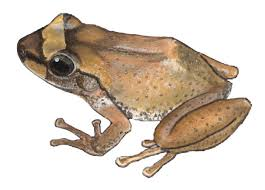

## Introduction

Coqui Frogs (Eleutherodactylus coqui), native to Puerto Rico, have become a prominent invasive species in Maui. Their presence is notable due to the loud mating calls of males, which can disrupt local ecosystems and human habitats.

## Impact of Coqui Frogs

- **Noise Pollution**: Male Coqui Frogs emit loud calls at night, which can be disruptive to residents and decrease property values.
- **Environmental Impact**: Coqui Frogs consume a vast amount of insects, potentially outcompeting native species and altering the local ecosystem.
- **Agricultural Damage**: These frogs can also be a nuisance in nurseries and gardens, where their high population densities can lead to significant plant damage.

## Identifying Coqui Frogs

- **Size**: Small, typically about 1-2 inches in length.
- **Color**: Generally light brown to dark brown.
- **Sound**: Known for their distinctive "ko-kee" call that occurs from dusk till dawn.

## Management Strategies

### Physical Removal

- Manually capturing and removing frogs is a common method employed during nighttime when they are most active and their calls are audible.

### Habitat Modification

- Removing vegetation and debris that can serve as hiding spots for Coqui Frogs reduces their preferred habitat.
- Ensuring that nurseries and gardens are not overly moist can deter frog populations from establishing.

### Chemical Control

- Citric acid and hydrated lime have been used effectively to reduce Coqui Frog populations. These treatments need to be applied carefully to minimize impacts on other wildlife and plants.

## Reporting Sightings

Prompt reporting of Coqui Frog sightings can help manage their spread and establish control measures effectively:

- **Phone**: [Local Invasive Species Committee Contact Number]
- **Online Reporting**: [Link to Local Invasive Species Committee Reporting Page]

Understanding and addressing the spread of Coqui Frogs is crucial for protecting Maui's biodiversity and maintaining quality of life for its residents.

For more information on control techniques and community efforts, please visit [Maui Invasive Species Committee](https://mauiinvasive.org/coqui-frog/).
